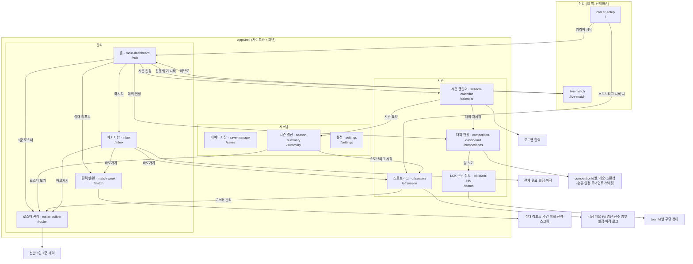

# UI 리디자인 — 페이지·버튼 그래프 (이식 체크리스트)

> 목적: UI를 갈아엎되 **메뉴/네비게이션/라우팅 뼈대는 그대로 유지**한다.
> 이 문서는 "현재 웹의 모든 페이지·하위페이지·주요 버튼" 인벤토리이자, 새 디자인으로 옮길 때 **빠진 화면이 없는지 확인하는 체크리스트**다.
> 근거 파일: `src/app/routes.ts`(라우트 정의), `src/shared/layout/appShellNavigation.tsx`(사이드바 데이터), `src/shared/layout/AppShell.tsx`(셸 렌더링), `src/pages/*`, `src/features/*`.

---

## 0. 뼈대(유지) vs 살(교체) — 한눈에

| 계층 | 역할 | 파일 | 리디자인 시 |
|---|---|---|---|
| **라우트 정의** | URL ↔ 화면 매핑, 파서/경로생성 (순수 로직) | `src/app/routes.ts` | **유지** |
| **네비 데이터** | 사이드바 메뉴 그룹/항목 (데이터 배열) | `src/shared/layout/appShellNavigation.tsx` | 라벨/아이콘만 손봄, **구조 유지** |
| **네비 핸들러** | `goToRoute`, 하위페이지 전환 콜백 | `src/app/hooks/useAppNavigation.ts` | **유지** |
| **URL 동기화** | 상태 ↔ URL 동기화 | `src/app/hooks/useRouteSynchronization.ts` | **유지** |
| **앱 셸(레이아웃)** | 사이드바/탑바 JSX + CSS | `src/shared/layout/AppShell.tsx` | **재작성(살)** |
| **화면 컴포넌트** | 각 페이지 마크업/스타일 | `src/features/*`, `src/pages/*` | **재작성(살)** — props/핸들러는 그대로 |
| **디자인 토큰/CSS** | 색·간격·타이포 | `src/shared/styles/global.css` + 토큰 | **재작성(살)** |
| **도메인 로직** | 게임 규칙·시뮬레이션 | `src/domain/*` | **무관(건드릴 필요 없음)** |

핵심: 라우팅이 JSX `<Routes>`가 아니라 **`routes.ts`의 순수 함수**로 되어 있고, 사이드바도 **`shellMenuGroups` 데이터 배열**이라 뼈대가 UI와 완전히 분리돼 있다 → 리스킨에 유리.

---

## 1. 네비게이션 그래프

---

## 2. 페이지 커버리지 표 (13 라우트)

> `*` = 기본 하위페이지. 버튼은 "주요"만, 세부는 `+α`로 표기.

| # | 라우트 | URL | 페이지 컴포넌트 | 하위페이지 | 주요 버튼/액션 |
|---|---|---|---|---|---|
| 1 | career-setup | `/` | `pages/CareerSetupPage` → `features/career-setup/CareerSetup` | – | 팀 카드 선택, "2026 실제 로스터로 시작" 체크, **커리어 시작**, 게임 가이드, (저장 패널) |
| 2 | main-dashboard | `/hub` | `pages/MainDashboardPage` → `features/main-dashboard/MainDashboard` | – | **진행/경기 시작→live-match**, 1군 로스터, 대회 현황, 시즌 일정, 상대 분석 패널→match-week, 메시지 패널→inbox, 팀 카드→teams |
| 3 | inbox | `/inbox` | `pages/InboxPage` → `features/inbox/Inbox` | 전체*·중요·일정·이적 | 필터 탭, 메시지 읽기, 모두 읽음, 메시지별 바로가기(→roster/match-week/offseason) |
| 4 | roster-builder | `/roster` | `pages/RosterBuilderPage` → roster-builder/management | 선발 5인(main*)·2군(academy)·계약(contracts) | 포지션 슬롯 DnD, 선수 제거, 방출, 계약 타입 드롭다운, **로스터 확정**, 마켓 선택/서명, 선수 상세 모달 |
| 5 | match-week | `/match` | `pages/MatchWeekPage` → `features/match-week/MatchWeek` | 상대 리포트(report*)·주간 계획(plan)·전략(strategy)·스크림(scrim) | 전략 선택, 스크림 신청/실행, 시즌 일정 보기 |
| 6 | competition-dashboard | `/competitions` | `pages/CompetitionDashboardPage` → `features/competition-dashboard/CompetitionDashboard` | `:competitionId` + 개요(overview*)·조편성(groups)·순위(standings)·일정(schedule)·토너먼트(tournament)·브래킷(bracket) | 대회 선택 카드, 하위 탭, 순위표 팀 행→teams, 경기 상세, 시즌 일정 |
| 7 | lck-team-info | `/teams` | `pages/LckTeamInfoPage` → `features/lck-team-info/LckTeamInfo` | `:teamId`(구단 상세) | 팀 카드 그리드, 팀 목록 back, 선수 상세 모달 |
| 8 | season-calendar | `/calendar` | `pages/SeasonCalendarPage` → `features/season-calendar/SeasonCalendar` | 로드맵(roadmap*)·달력(calendar) | 뷰 전환, 월 이동, 경기 셀→competition, 대회 자세히, 시즌 요약 |
| 9 | save-manager | `/saves` | `pages/SaveManagerPage` → `features/save-manager/SaveManager` | – | 저장/새 저장/불러오기/삭제, 활성 세이브 전환, 충돌 감지 |
| 10 | offseason | `/offseason` | `pages/OffseasonPage` → `features/offseason/OffseasonMarket` | 시장 개요(overview*)·FA 명단(free-agents)·선수 명부(all-players)·일정(schedule)·이적 로그(log) | 탭, 갱신 제안/제안하기→ContractOfferModal, 확정/취소, 계약 해지, 선수 보기, 로스터 관리 |
| 11 | season-summary | `/summary` | `pages/SeasonSummaryPage` → `features/season-summary/SeasonSummary` | – | 시즌 히스토리 카드 선택, 로스터 보기, **스토브리그 시작→offseason** |
| 12 | settings | `/settings` | `pages/SettingsPage` | – | 테마(다크/화이트), 가이드 표시 체크 + 보기, 배경음/효과음/나레이션, 뉴스 빈도 라디오, (개발자 모드) |
| 13 | live-match | `/live-match` | `pages/LiveMatchPage` → `features/live-match/LiveMatchPrototype` | (내부 상태: 밴픽→경기→세트브레이크→시리즈종료) | 경기 시작, 재생/일시정지/배속, 결과 확인, 다음 세트, 경기 내용 보기, **허브로** |

**경쟁(대회) 변형**: competition-dashboard 하나가 `competitionId`에 따라 LCK Cup / First Stand / LCK Rounds 1-2 / MSI / LCK Rounds 3-5 / LCK Rounds 3-4 / Worlds / Asian Games 8종 대시보드로 렌더된다. 리스킨 시 **탭 셸 1개 + 대회별 변형**으로 보면 됨.

---

## 3. 공유 UI 컴포넌트 (리스킨 빌딩 블록)

`src/shared/ui/*` 위주 — 이걸 새 디자인 시스템으로 먼저 갈아끼우면 화면 대부분이 따라온다.

| 컴포넌트 | 파일(추정) | 용도 |
|---|---|---|
| Button | `shared/ui/Button` | `variant: primary \| ghost` — 거의 모든 화면 |
| Card | `shared/ui/Card` | 패널 래퍼 |
| PlayerDetailModal | `shared/ui/PlayerDetailModal` | 선수 상세 풀스크린 |
| PlayerCard / PlayerPortrait | `shared/ui/*` | 선수 카드·초상 |
| PlayerAttributePanel | `shared/ui/PlayerAttributePanel` | 능력치 그리드 |
| EvaluationStars / MoraleIndicator / StatPill | `shared/ui/*` | 평가·사기·스탯 뱃지 |
| TeamLogo | `shared/ui/TeamLogo` | 팀 로고 |
| ContractOfferModal | `features/offseason/ContractOfferModal` | 계약 제안 |
| GameGuideModal | `features/game-guide/GameGuideModal` | 가이드 |
| SaveManager | `features/save-manager/SaveManager` | 저장 패널 |
| **AppShell** | `shared/layout/AppShell` | 사이드바/탑바 — **리스킨 1순위** |

---

## 4. 이식 전략(권장 순서)

1. **디자인 토큰 먼저** — 색/간격/타이포 토큰을 새 디자인 기준으로 정의(라이트모드 하드코딩 버그도 이때 정리). 기존 토큰 가드레일 테스트 기준 유지.
2. **공유 컴포넌트 교체** — `Button/Card/Modal/PlayerCard/TeamLogo` 등 §3을 먼저. 화면 다수가 자동 반영.
3. **AppShell 재작성** — 사이드바/탑바. `shellMenuGroups` 데이터는 그대로 소비.
4. **화면별 포팅** — §2 표를 체크리스트 삼아 한 페이지씩. props·핸들러·도메인 호출은 유지, 마크업/className만 새로.
5. **회귀 방지** — 통합 테스트가 텍스트/구조 셀렉터에 의존하면 포팅하며 갱신(도메인 테스트는 무관).

**주의(라이트박스 예외)**: live-match는 다크모드 전용(디자인 토큰 예외) — 리스킨 시 별도 취급.

---

## 5. 미결(새 디자인 방향)

- 디자인 방향(톤·레퍼런스·컴포넌트 라이브러리 도입 여부)은 **아직 미정**. 정해지면 §4-1의 토큰 정의부터 시작.
